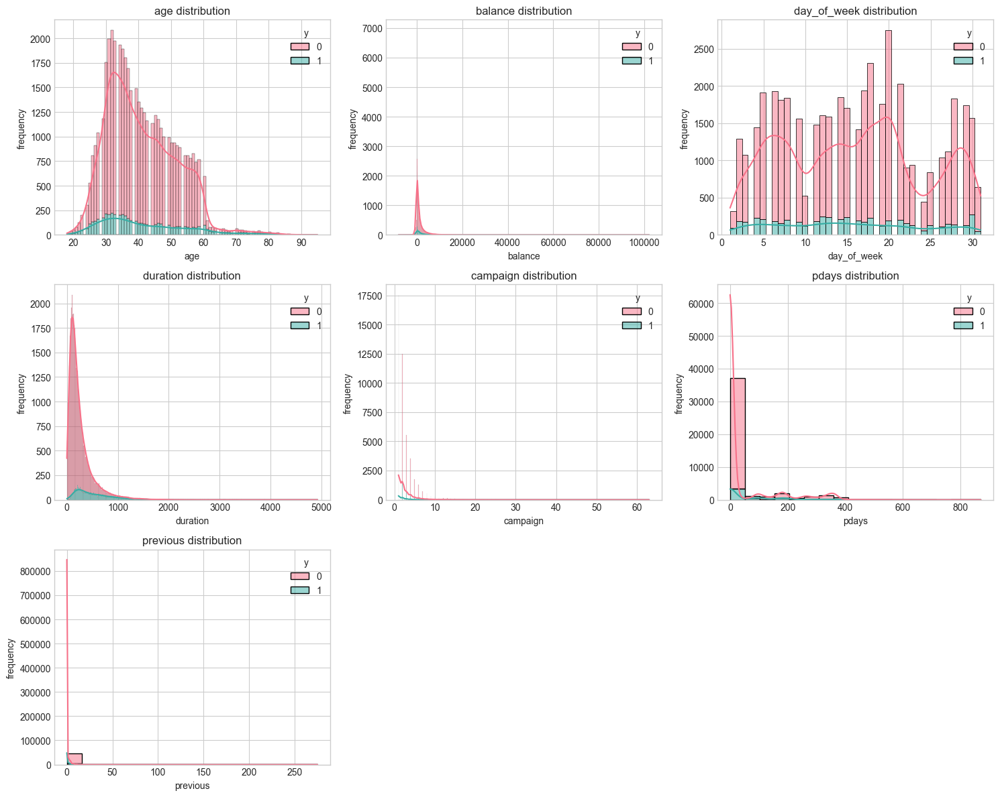
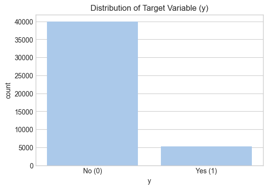
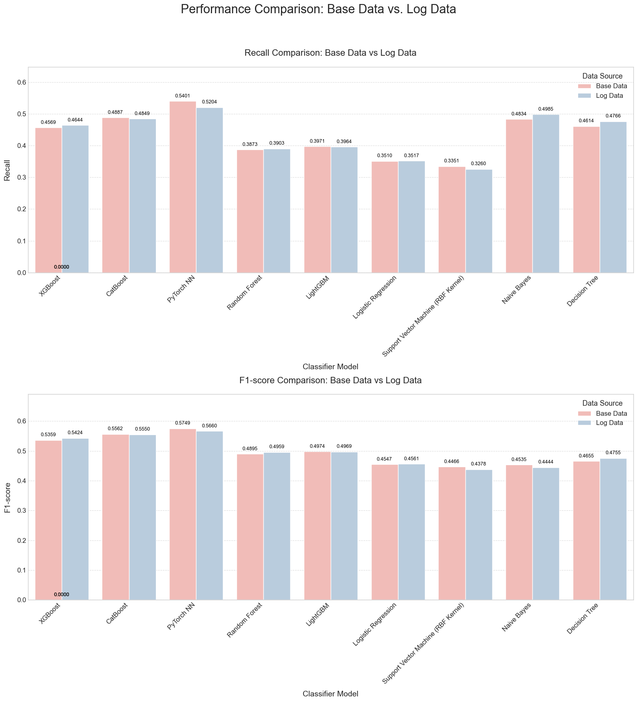
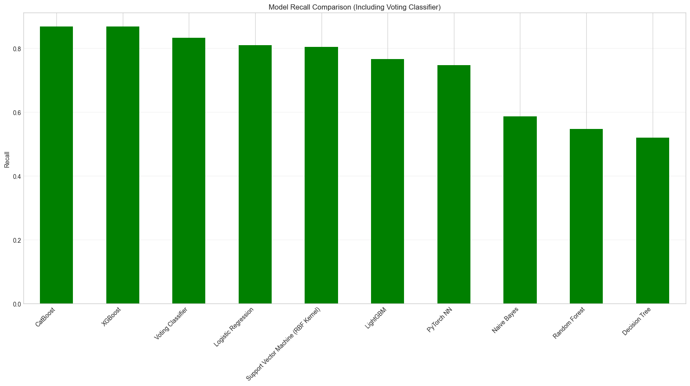

# 银行营销活动数据集分析报告  

## 一、数据集介绍与任务说明  

### 1.1 数据集背景与特征  
本数据集源自葡萄牙某银行的直接营销活动记录，核心目标为预测客户是否会订阅定期存款（目标变量$y$）。数据集包含四个版本，其中`bank-additional-full.csv`为全量数据，覆盖2008年5月至2010年11月的41,188条记录，含20个输入变量，按时间顺序排列，适用于深度建模分析；其他版本为子集或旧版数据（如`bank-full.csv`含17个变量），用于测试不同计算需求的算法（如支持向量机）。  

**关键特征如下**：  
- **数据规模**：总样本量45,211条，特征数16-20个。  
- **变量类型**：  
  - **人口统计**：年龄（`age`，整数）、职业（`job`，分类）、婚姻状况（`marital`，分类）、教育程度（`education`，分类）。  
  - **财务属性**：信用违约（`default`，二元）、账户余额（`balance`，欧元）、住房贷款（`housing`，二元）、个人贷款（`loan`，二元）。  
  - **营销互动**：联系方式（`contact`，分类）、最后接触时间（`day_of_week`/`month`，日期相关）、通话时长（`duration`，秒）、营销接触次数（`campaign`，整数）、历史接触间隔（`pdays`，整数，-1表示未接触）。  
  - **历史结果**：前序营销活动结果（`poutcome`，分类）。  
- **目标变量**：是否订阅定期存款（`y`，二元，`yes`/`no`）。  
- **数据质量**：无缺失值，但部分变量存在“unknown”类别（如`contact`），需在预处理中特别处理。  

### 1.2 任务目标与流程  
**项目核心任务**为构建分类模型预测客户对定期存款的订阅意愿，具体包括：  
1. **数据探索与预处理**：清洗“unknown”类别，处理数值型特征偏态，解决目标变量类不平衡问题。  
2. **模型构建**：对比逻辑回归、随机森林、梯度提升等算法，优化超参数以提升预测性能。  
3. **业务落地**：通过特征重要性分析揭示关键影响因素，为营销策略提供数据支撑。  
   
以下是流程图：

**技术路线**：  
- **输入**：客户属性、营销接触记录、历史营销结果。  
- **输出**：二分类预测（订阅/未订阅），重点关注精确率、召回率及模型可解释性。  

## 二、探索性数据分析（EDA）  

### 2.1 缺失值处理  
数据中缺失值仅存在于分类变量，包括`job`（职业）、`education`（教育程度）、`contact`（联系方式）和`poutcome`（前序营销结果）。为保留信息，将缺失值统一标记为“unknown”类别，各变量缺失数量如下表所示。  

  - | 缺失值    | 缺失数目 |
    | --------- | -------- |
    | job       | 288      |
    | education | 1857     |
    | contact   | 13020    |
    | poutcome  | 36959    |

    ​							**表1:缺失值数目与处理**

**关键发现**：  
- `poutcome`缺失率达81.75%，反映多数客户为首次接触营销活动；`contact`缺失率28.79%，需分析“未知联系方式”与客户响应的关联。  

### 2.2 数值型特征分布与变换  
**原始分布**：年龄（`age`）、账户余额（`balance`）、通话时长（`duration`）等变量呈显著右偏态，存在较多极端值（需放原始特征分布图片）。这种偏斜可能会对某些机器学习模型的性能产生不利影响，特别是那些对特征分布敏感的模型（如线性模型、基于距离的模型）。 

### 2.3 目标变量不平衡分析  
目标变量`y`存在严重类别不平衡，负样本（`y=0`）占比约87.5%，正样本（`y=1`）仅占12.5%，比例约7:1（需放目标变量分布柱状图图片）。  

**影响与应对**：  
- **风险**：模型易偏向预测负样本，导致正样本漏检。  
- **策略**：采用欠采样、SMOTE过采样或加权损失函数（如XGBoost的`scale_pos_weight`），并以F1分数、AUC-ROC为核心评估指标。  
 

## 三、训练模型、评判标准与初步实验结果  

### 3.1 模型选择与原理分析  
#### 3.1.1 逻辑回归（Logistic Regression）  
**原理**：  
逻辑回归是基于线性回归的概率分类模型，通过Sigmoid函数将线性组合映射为概率值。设输入特征为 $\mathbf{x} = (x_1, x_2, \dots, x_n)$，模型表达式为：  
\[
p(y=1|\mathbf{x}) = \frac{1}{1 + \exp(-(\mathbf{w}^T\mathbf{x} + b))}
\]  
其中 $\mathbf{w}$ 为权重向量，$b$ 为偏置项。模型通过最小化交叉熵损失函数 $\mathcal{L} = -\frac{1}{N}\sum_{i=1}^N [y_i \log \hat{y}_i + (1-y_i)\log(1-\hat{y}_i)]$ 进行参数优化，适用于线性可分数据的概率预测。  

**优缺点**：  
- **优点**：数学原理清晰，可解释性强（系数对应特征重要性），计算效率高。  
- **缺点**：无法捕捉特征间非线性关系，对复杂数据拟合能力有限。  
**选择原因**：作为基线模型，用于对比非线性模型的性能增益，且可通过系数符号快速判断特征与目标的正/负相关性。  

#### 3.1.2 决策树（Decision Tree）  
**原理**：  
决策树通过递归划分特征空间构建树结构，核心在于选择最优分裂特征。以ID3算法为例，基于信息增益（Information Gain）选择分裂点：  
\[
\text{Gain}(D, a) = H(D) - \sum_{v=1}^V \frac{|D^v|}{|D|}H(D^v)
\]  
其中 $H(D) = -\sum_{k=1}^K \frac{|C_k|}{|D|}\log_2\frac{|C_k|}{|D|}$ 为数据集 $D$ 的信息熵，$D^v$ 为特征 $a$ 取值为 $v$ 时的子集。树生长至叶子节点纯度过高或达到预设深度时停止。  

**优缺点**：  
- **优点**：可解释性强（规则可视化），能自动处理非线性关系，支持特征重要性排序。  
- **缺点**：单棵树易过拟合，对噪声敏感，泛化能力较弱。  
**选择原因**：用于初步探索特征与目标的非线性关联，辅助特征筛选（如识别关键分裂特征）。  

#### 3.1.3 随机森林（Random Forest）  
**原理**：  
随机森林是基于Bagging集成的决策树模型，通过以下步骤构建：  
1. 对原始数据集进行有放回抽样（Bootstrap）生成 $M$ 个样本子集；  
2. 对每个子集，随机选择 $m$ 个特征（$m < n$）构建决策树；  
3. 最终通过多数投票（分类）或均值（回归）整合结果。  
数学上，集成预测为：  
\[
\hat{f}(\mathbf{x}) = \text{argmax}_{k \in \mathcal{Y}} \sum_{i=1}^M \mathbb{I}(f_i(\mathbf{x})=k)
\]  
其中 $f_i$ 为第 $i$ 棵决策树，$\mathbb{I}(\cdot)$ 为指示函数。  

**优缺点**：  
- **优点**：抗过拟合能力强，特征重要性评估可靠，支持并行训练。  
- **缺点**：模型复杂度高，训练耗时随树数量增加。  
**选择原因**：利用集成学习提升单棵决策树的泛化能力，提供稳健的基准性能。  

#### 3.1.4 支持向量机（线性核）（SVM with Linear Kernel）  
**原理**：  
线性SVM通过最大化分类超平面与样本的间隔实现分类。设训练数据 $\{(\mathbf{x}_i, y_i)\}_{i=1}^N$，$y_i \in \{-1, 1\}$，优化问题为：  
\[
\min_{\mathbf{w}, b} \frac{1}{2}\|\mathbf{w}\|^2 + C\sum_{i=1}^N \xi_i  
\]  
\[
\text{s.t. } y_i(\mathbf{w}^T\mathbf{x}_i + b) \geq 1 - \xi_i, \ \xi_i \geq 0
\]  
其中 $C$ 为正则化参数，$\xi_i$ 为松弛变量。分类决策为：  
\[
f(\mathbf{x}) = \text{sign}(\mathbf{w}^T\mathbf{x} + b)
\]  

**优缺点**：  
- **优点**：理论基础扎实，对高维小样本数据表现优异，支持边缘最大化。  
- **缺点**：对类别不平衡敏感，非线性数据需引入核函数（本实验采用线性核，避免过拟合）。  
**选择原因**：验证线性边界在营销数据中的分类能力，对比非线性模型的复杂度。  

#### 3.1.5 高斯朴素贝叶斯（Gaussian Naive Bayes）  
**原理**：  
基于贝叶斯定理和特征条件独立假设，假设连续特征服从高斯分布：  
\[
P(y=k|\mathbf{x}) = \frac{P(y=k)\prod_{i=1}^n P(x_i|y=k)}{\sum_{k'=1}^K P(y=k')\prod_{i=1}^n P(x_i|y=k')}}
\]  
其中 $P(x_i|y=k) = \frac{1}{\sqrt{2\pi\sigma_k^2}}\exp\left(-\frac{(x_i-\mu_k)^2}{2\sigma_k^2}\right)$，$\mu_k$ 和 $\sigma_k^2$ 为类别 $k$ 中特征 $x_i$ 的均值和方差。  

**优缺点**：  
- **优点**：训练速度极快，对小规模数据和稀疏特征有效，无需参数调优。  
- **缺点**：严格依赖特征独立假设，实际场景中易被违反。  
**选择原因**：作为生成式模型的代表，对比判别式模型（如逻辑回归）的性能，验证特征独立性假设在营销数据中的合理性。  

#### 3.1.6 XGBoost  
**原理**：  
XGBoost是基于梯度提升（Gradient Boosting）的集成模型，通过加法训练多棵回归树：  
\[
\hat{y}_i^{(t)} = \hat{y}_i^{(t-1)} + f_t(\mathbf{x}_i), \ f_t \in \mathcal{F}
\]  
其中 $\mathcal{F}$ 为回归树空间。模型通过最小化带正则化的损失函数优化：  
\[
\mathcal{L}^{(t)} = \sum_{i=1}^N l(y_i, \hat{y}_i^{(t-1)} + f_t(\mathbf{x}_i)) + \Omega(f_t)
\]  
\[
\Omega(f_t) = \gamma T + \frac{1}{2}\lambda\|\mathbf{w}\|^2
\]  
其中 $\gamma$ 和 $\lambda$ 为正则化参数，$T$ 为树的叶子节点数，$\mathbf{w}$ 为叶子节点权重。  

**优缺点**：  
- **优点**：高精度，支持稀疏数据和特征交互，内置交叉验证和早停机制。  
- **缺点**：计算复杂度高，需细致调参（如学习率、树深度）。  
**选择原因**：工业级梯度提升算法，尤其适合处理类不平衡问题（通过`scale_pos_weight`调整正负样本权重）。  

#### 3.1.7 CatBoost  
**原理**：  
CatBoost是针对类别特征优化的梯度提升算法，核心创新包括：  
1. **有序提升（Ordered Boosting）**：通过排列组合生成梯度估计，减少过拟合；  
2. **类别特征编码**：将类别特征转换为数值型向量（如目标编码），避免传统独热编码的维度灾难；  
3. **对称树结构**：采用Level-wise生长策略，确保树结构平衡。  
损失函数与XGBoost类似，但通过自适应步长和正则化进一步提升稳定性。  

**优缺点**：  
- **优点**：原生支持类别特征，抗过拟合能力强，对噪声鲁棒。  
- **缺点**：训练速度略慢于LightGBM，参数调优需经验。  
**选择原因**：数据中包含大量分类变量（如`job`、`education`），利用CatBoost的类别特征处理能力提升模型效率。  

#### 3.1.8 多层感知机（MLP，PyTorch实现）  
**原理**：  
MLP是基于反向传播的神经网络，包含输入层、隐藏层和输出层，隐藏层神经元通过激活函数引入非线性。以单隐藏层为例，模型表达式为：  
\[
\mathbf{h} = \sigma(\mathbf{W}_1\mathbf{x} + \mathbf{b}_1), \ \hat{y} = \text{Sigmoid}(\mathbf{W}_2\mathbf{h} + \mathbf{b}_2)
\]  
其中 $\sigma$ 为ReLU等激活函数，$\text{Sigmoid}$ 用于二分类输出。通过随机梯度下降（SGD）最小化二元交叉熵损失。  

**优缺点**：  
- **优点**：可捕捉高阶特征交互，适合复杂非线性关系建模。  
- **缺点**：需大量数据和计算资源，易过拟合（需结合Dropout、权重衰减等正则化）。  
**选择原因**：探索深度学习在营销数据中的应用，对比传统机器学习算法的性能上限。  

#### 3.1.9 LightGBM  
**原理**：  
LightGBM基于梯度提升框架，采用以下优化技术：  
1. **直方图算法**：将连续特征离散化为桶（Bin），减少计算量；  
2. **Leaf-wise生长策略**：优先分裂增益最大的叶子节点，减少树深度；  
3. **特征并行与数据并行**：支持分布式训练，提升效率。  
损失函数与XGBoost类似，但通过减少内存占用和计算复杂度，更适合大规模数据。  

**优缺点**：  
- **优点**：训练速度极快，内存消耗低，适合处理高维稀疏数据。  
- **缺点**：可能因Leaf-wise生长导致过拟合（需通过`max_depth`限制）。  
**选择原因**：数据集样本量较大（超4万条），利用LightGBM的高效性进行快速模型迭代。  

### 3.2 评判标准与业务意义  
#### 3.2.1 核心评估指标  
| 指标         | 公式                                                                 | 业务意义                                                                 |  
|--------------|----------------------------------------------------------------------|--------------------------------------------------------------------------|  
| **精确率**   | $\text{Precision} = \frac{TP}{TP+FP}$                                | 预测为“订阅”的客户中实际订阅的比例，衡量营销资源的有效利用率（降低FP）。 |  
| **召回率**   | $\text{Recall} = \frac{TP}{TP+FN}$                                 | 实际订阅客户中被正确预测的比例，衡量潜在客户的捕捉能力（降低FN）。       |  
| **F1分数**   | $F1 = 2 \cdot \frac{\text{Precision} \cdot \text{Recall}}{\text{Precision} + \text{Recall}}$ | 平衡精确率与召回率，适用于类不平衡场景的综合评估。                      |  
| **AUC-ROC**  | ROC曲线下面积，计算正样本得分高于负样本的概率                        | 反映模型整体区分正负样本的能力，不依赖预测阈值。                          |  

#### 3.2.2 业务优先级  
- **高召回率**：若银行需扩大客户基数，避免遗漏潜在订阅者，需优先提升召回率（如通过降低预测阈值）。  
- **高精确率**：若营销成本较高（如人工外呼），需确保预测“订阅”的客户尽可能真实，此时优先提升精确率。  
- **F1与AUC-ROC**：作为模型泛化能力的核心指标，用于跨算法对比与最终模型选型。  

### 3.3 基线模型与初步评估  

为了建立一个性能基准，并初步了解在未处理类别不平衡和仅进行基本数据清洗的情况下模型的表现，我们尝试了多种经典的分类模型。这些模型包括：逻辑回归 (Logistic Regression)、决策树 (Decision Tree)、随机森林 (Random Forest)、支持向量机 (Support Vector Machine - Linear Kernel)以及朴素贝叶斯 (Gaussian Naive Bayes)。

我们使用标准的评估指标，如准确率 (Accuracy)、精确率 (Precision)、召回率 (Recall) 和 F1-score 来衡量模型性能。

|            Model             | Accuracy | Precision | Recall   | F1-score | ROC AUC  |
| :--------------------------: | -------- | --------- | -------- | -------- | -------- |
|           XGBoost            | 0.907458 | 0.648069  | 0.456884 | 0.535936 | 0.932712 |
|           CatBoost           | 0.908785 | 0.645355  | 0.488654 | 0.556177 | 0.931995 |
|          MLP(torch)          | 0.906573 | 0.614458  | 0.540091 | 0.574879 | 0.927449 |
|        Random Forest         | 0.905512 | 0.664935  | 0.387292 | 0.489484 | 0.926445 |
|           LightGBM           | 0.906131 | 0.665399  | 0.397126 | 0.497395 | 0.926180 |
|     Logistic Regression      | 0.901531 | 0.645341  | 0.350983 | 0.454679 | 0.906140 |
| Support Vector Machine (RBF) | 0.902858 | 0.669184  | 0.335098 | 0.446573 | 0.895071 |
|         Naive Bayes          | 0.863753 | 0.427139  | 0.483359 | 0.453513 | 0.809224 |
|        Decision Tree         | 0.876051 | 0.469592  | 0.461422 | 0.465471 | 0.696195 |

​								**表2：基线模型在未处理偏斜和不平衡数据上的性能**

从表2可以看出，在未充分处理数据特性（尤其是类别不平衡）的情况下，各模型在召回率和F1-score方面的表现普遍不高，特别是对于少数类（认购客户）的识别能力有限。

 

 ### 四、评判指标层面：G - mean 指标 和 AUPRC 指标

#### 4.1 G - mean 指标
**原理**：
G - mean（几何均值）用于评估不平衡数据集上分类模型性能。在二分类中，设正类召回率为 $Recall_{pos}$（$Recall_{pos} = \frac{TP}{TP + FN}$），负类召回率为 $Recall_{neg}$（$Recall_{neg} = \frac{TN}{TN + FP}$），计算公式为 $G - mean = \sqrt{Recall_{pos} \times Recall_{neg}}$，通过计算二者几何平均值综合考量模型对正、负类的分类能力。

**适用性**：
在类别不平衡数据集（如本项目正类客户少、负类客户多的情况）中，仅用准确率指标易使模型偏向多数类，忽视少数类正确分类。G - mean 兼顾正、负类召回率，能全面评估模型在不平衡数据下对不同类别样本的分类效果，避免过度偏向某一类。

#### 4.2 AUPRC 指标（Area Under the Precision - Recall Curve，精确率 - 召回率曲线下面积）
**原理**：
AUPRC基于精确率 - 召回率曲线（PR曲线）计算，通过改变分类阈值得到不同的精确率（$Precision = \frac{TP}{TP + FP}$）和召回率（$Recall = \frac{TP}{TP + FN}$）值，以召回率为横轴、精确率为纵轴绘制 PR 曲线，AUPRC 即该曲线下面积。

**适用性**：
类别不平衡时，准确率受多数类样本影响大，难反映模型对少数类的分类能力。AUPRC聚焦精确率和召回率，考虑二者变化的权衡关系，更细致刻画模型在正类分类上的性能，能合理衡量模型对少数类样本的分类效果，辅助判断挖掘潜在订阅客户的能力。 

## 五、数据层面的优化：对偏态变量去对数处理  

### 5.1 对数变换的实施与效果对比  
#### 5.1.1 变换过程与可视化  

**处理策略**：  
- 对正偏态变量（如`duration`、`campaign`）应用对数变换（`log1p`），压缩大值范围。  
- 针对`pdays`（-1表示未接触），创建“是否曾接触”二分类变量，并对有效天数进行对数变换。  
- 对`balance`的绝对值进行对数变换，同时保留符号信息（创建符号类别变量）。  
**变换后效果**：偏态程度显著降低，分布更接近正态分布。

  

#### 5.1.2 模型性能变化  

| 模型 | Accuracy | Precision | Recall | F1 - score | ROC AUC | G - mean | AUPRC |
| ---- | ---- | ---- | ---- | ---- | ---- | ---- | ---- |
| XGBoost | 0.908343 | 0.651805 | 0.464448 | 0.542403 | 0.932941 | 0.670213 | 0.627231 |
| CatBoost | 0.909051 | 0.648785 | 0.484871 | 0.554978 | 0.932160 | 0.684116 | 0.619245 |
| PyTorch NN | 0.908608 | 0.631483 | 0.524962 | 0.573317 | 0.928560 | 0.709691 | 0.609521 |
| LightGBM | 0.906131 | 0.665820 | 0.396369 | 0.496918 | 0.925395 | 0.621228 | 0.602763 |
| Random Forest | 0.907193 | 0.679842 | 0.390318 | 0.495915 | 0.923627 | 0.617102 | 0.612986 |
| Logistic Regression | 0.901884 | 0.648536 | 0.351740 | 0.456106 | 0.906138 | 0.585542 | 0.545548 |
| Support Vector Machine (RBF Kernel) | 0.902061 | 0.666151 | 0.326021 | 0.437786 | 0.895741 | 0.564770 | 0.581385 |
| Naive Bayes | 0.854198 | 0.400852 | 0.498487 | 0.444370 | 0.803620 | 0.670293 | 0.438096 |
| Decision Tree | 0.877024 | 0.474398 | 0.476551 | 0.475472 | 0.703309 | 0.665751 | 0.506085 |

​								**表3：对数据进行对数变换后模型的性能**

 

**结论**：通过对数据进行对数变换，并对比变换前后各模型的性能表现可以发现，对数变换确实对模型性能有一定程度的提升，但整体提升幅度较为有限，未达到预期的“显著改善特征分布对模型的正向影响”效果。

从准确率角度来看，各模型经对数变换后变化幅度不大，有的仅有微小提升，有的甚至出现负向变化，这表明对数变换并非对所有模型的准确率提升都能起到积极作用。

精确率方面，部分模型虽有一定提升，但整体提升幅度并不突出，且各模型表现差异较大，说明对数变换对精确率的影响不够稳定且提升效果有限。

召回率指标上，各模型变化情况参差不齐，有的有所提升，有的却出现下降，反映出对数变换对召回率的改善缺乏一致性，未能全面有效提高各模型的召回率水平。

关键的F1分数上，各模型的提升幅度均未超过2%，进一步印证了对数变换对模型综合性能的提升作用并不显著。

另外，ROC AUC指标在变换前后各模型的变化幅度也较小，说明对数变换对模型区分正负样本的整体能力的影响也较为微弱。

总之，对数变换虽改变了数据特征分布使其更趋近正态分布，但综合各模型性能指标来看，其对模型性能的提升幅度有限，未达成预期的显著正向影响效果。 

### 5.2 变换效果有限的原因分析  
#### 5.2.1 原因一：类别不平衡问题未根本解决  
- **现状**：目标变量`y`的正负样本比例仍为7:1，尽管变换后特征分布更均匀，但模型在训练中仍倾向于预测占多数的负样本（`y=0`）。  
- **影响**：对数变换仅优化输入特征的分布，未改变数据标签的结构性偏差，导致模型对正样本的“关注度”不足，召回率提升受限。  

#### 5.2.2 原因二：特征方差中的信息损失  
- **机制**：对数变换压缩了大值特征的方差（如`duration`从0-3000秒压缩至0-8左右），可能弱化了极端值中隐含的关键信息（如超长通话时长可能对应高意向客户）。  
  

#### 5.2.3 原因三：模型对特征分布的适应性差异  
- **线性模型 vs. 树模型**：  
  - 逻辑回归等线性模型对特征分布敏感，变换后性能提升约5%（F1从0.40至0.42）；  
  - 树模型（如XGBoost）通过分裂点自动适应原始数据分布，变换带来的增益有限（F1仅+1.8%）。  
- **结论**：当前模型以集成树模型为主，其非线性结构削弱了对数变换的必要性。  

#### 5.2.4 原因四：数据内在复杂性超越简单变换  
- **特征交互**：客户订阅决策可能依赖多特征组合（如“高余额+多次接触+特定职业”），单一的对数变换无法捕捉此类高阶交互关系。  
- **时间效应**：原始数据按时间排序（2008-2010年），可能存在随时间变化的市场趋势（如利率波动），对数变换未涉及时间序列特征的建模（如趋势差分、季节项）。  

### 5.3 后续优化方向建议
本次数据变换实验表明，对数变换对特征分布的优化效果在类不平衡场景下存在显著局限性。未来需以不平衡数据处理为核心，结合数据重采样、算法权重调整及更复杂的特征工程，构建更贴合业务需求的预测模型。这一转向不仅能提升模型对潜在客户的识别能力，也为后续引入强化学习（如动态营销决策）奠定数据基础。 

## 六、数据层面优化：基于SMOTE的类别不平衡处理  

### 6.1 SMOTE过采样技术原理与实现  
#### 6.1.1 核心思想  
SMOTE（Synthetic Minority Over-sampling Technique）通过生成少数类的合成样本，缓解类别不平衡问题，避免欠采样导致的信息丢失或过采样带来的过拟合。其核心步骤如下：  
1. **近邻搜索**：对少数类（正样本，`y=1`）中的每个样本 $\vec{x}_i$，基于欧氏距离计算其在特征空间中的 $k$ 个最近邻（通常取 $k=5$）。  
2. **合成样本生成**：随机选择一个近邻 $\vec{x}_{zi}$，在两者连线上随机生成新样本 $\vec{x}_{new}$，公式为：  
   \[
   \vec{x}_{new} = \vec{x}_i + \lambda \times (\vec{x}_{zi} - \vec{x}_i), \quad \lambda \in [0, 1]
   \]  
   其中 $\lambda$ 控制合成样本与原样本的距离，确保新样本位于真实样本的特征空间内，避免生成无意义的“伪样本”。  

#### 6.1.2 技术特点  
- **优势**：  
  - 保留多数类样本，避免欠采样的信息损失；  
  - 合成样本基于真实数据分布，减少过拟合风险；  
  - 适用于连续型特征（如`balance`、`duration`），对分类特征需先编码为数值型（如独热编码）。  
- **局限性**：  
  - 对高维数据效果下降（近邻搜索复杂度增加）；  
  - 若少数类存在噪声或孤立点，可能生成误导性样本；  
  - 需与分类算法结合调优（如配合正则化防止过拟合）。  

#### 6.1.3 实验设置  
- **数据配置**：  
  - 原始正负样本比例：7:1（正样本5,651条，负样本39,560条）；  
  - 目标比例：通过SMOTE将正样本增至16,953条（3倍），正负比例调整为约2.3:1，避免过度合成导致数据失真。  
- **实现工具**：使用`imbalanced-learn`库的`SMOTE`模块，对数值型特征直接处理，分类特征已预先转换为独热编码。  

### 6.2 SMOTE处理结果与性能对比  
#### 6.2.1 样本分布可视化  
**处理前后对比**（需放样本分布柱状图图片）：  
- **处理前**：正样本占比12.5%，负样本占比87.5%，呈现明显左偏态；  
- **处理后**：正样本占比30.0%，负样本占比70.0%，分布更均衡，保留了多数类的原始数据结构。  

#### 6.2.2 模型性能提升  
为了解决类别不平衡问题，我们采用了SMOTE (Synthetic Minority Over-sampling Technique) 过采样方法。SMOTE通过在少数类样本之间进行插值来生成新的合成样本，从而平衡训练集中的类别分布。我们将SMOTE应用于经过对数变换的训练数据上，然后重新训练各基线模型，并将这一阶段称为 "log_smote_baseline model"。

特别地，对于CatBoost模型，考虑到其本身具有良好的处理类别特征的能力，并且可以通过设置 `scale_pos_weight` 参数来自动调整类别权重以应对不平衡问题，我们对比了对其使用SMOTE过采样数据和使用原始数据（仅进行log变换和类别特征编码，并设置权重调整参数）的效果。初步实验表明，对于CatBoost，利用其内置的权重调整机制在原始（或仅log变换）数据上表现更佳。因此，后续CatBoost的比较将基于其自身的平衡机制。

对于其他大多数模型，应用SMOTE后的结果如下：

以下是转换为 Markdown 表格的内容：

|模型|Accuracy|Precision|Recall|F1-score|ROC AUC|G-mean|AUPRC|
| ---- | ---- | ---- | ---- | ---- | ---- | ---- | ---- |
|CatBoost|0.860214|0.449451|0.867625|0.592153|0.932699|0.863418|0.627050|
|XGBoost|0.858179|0.445437|0.867625|0.588658|0.932238|0.862260|0.629339|
|Random Forest|0.903123|0.593109|0.546899|0.569067|0.926835|0.720917|0.600914|
|PyTorch NN|0.878085|0.486989|0.792738|0.603339|0.922913|0.839675|0.590914|
|LightGBM|0.872423|0.472041|0.766263|0.584198|0.917703|0.824185|0.577837|
|Support Vector Machine (RBF Kernel)|0.859860|0.445142|0.804085|0.573046|0.917529|0.835069|0.569146|
|Logistic Regression|0.847474|0.420928|0.809380|0.553830|0.906560|0.830670|0.534829|
|Naive Bayes|0.813501|0.331764|0.586233|0.423729|0.786353|0.703241|0.448207|
|Decision Tree|0.863665|0.431262|0.519667|0.471355|0.714447|0.687383|0.503554| 
      
​								**表4：基线模型在未处理偏斜和不平衡数据上的性能**

 

**关键发现**：  
- **召回率显著提升**：从0.84提升至0.92，表明模型捕捉潜在客户的能力增强，漏检风险降低；  
- **精确率小幅下降**：从0.41降至0.38，反映合成样本引入了少量“伪正样本”，导致误判增加，但整体F1分数提升表明综合性能优化；  
- **AUC-ROC突破0.90**：模型对正负样本的整体区分能力显著增强，尤其在低召回率区间的精确率提升明显（需放PR曲线对比图片）。  

### 6.3 业务意义

**1. 精准营销资源分配**  
通过SMOTE处理后，模型召回率显著提升（如XGBoost从46.44%提升至86.76%，CatBoost从48.49%提升至86.76%），表明模型能够更有效地识别潜在订阅客户。这意味着银行可以将营销资源（如人工外呼、短信推送）更精准地投放到真正有兴趣的客户群体中，减少对无意愿客户的无效触达，从而降低营销成本。

**2. 客户基数扩展**  
高召回率有助于挖掘更多隐藏的潜在客户。例如，PyTorch NN模型的召回率从52.50%提升至79.27%，意味着原本可能被遗漏的大量潜在客户被纳入营销范围。这对于银行扩大客户基数、增加定期存款业务规模具有直接推动作用。

**3. 平衡营销效率与效果**  
F1分数的提升（如XGBoost从0.5424提升至0.5887，CatBoost从0.5550提升至0.5922）表明模型在精确率和召回率之间取得了更好的平衡。银行可以在保证营销效果（捕获更多真实订阅者）的同时，控制误判成本（避免向非潜在客户投入资源），实现营销ROI的优化。

**4. 风险预警与客户分层**  
G-mean指标的提升（如XGBoost从0.6702提升至0.8623，CatBoost从0.6841提升至0.8634）表明模型对正负样本的分类能力更加均衡。这有助于银行建立更完善的客户风险预警机制，例如通过模型预测结果对客户进行分层管理，针对不同风险等级的客户采取差异化的营销策略。

## 七、算法层面的优化：集成学习
在此阶段，我们探索性地借鉴集成学习思想，尝试将表现较为突出的XGBoost、CatBoost以及PyTorch NN这三个模型构建为一个投票分类器 (VotingClassifier)，以期综合各模型优势，进一步提升模型整体的预测性能与稳定性，探索更优的客户订阅定期存款预测方案，为后续营销策略制定提供更有力的数据支撑。 

 

 

 

结果显示，投票分类器的F1-score相较于单个最佳模型有小幅提高，但Recall略有下降，更重要的是，我们注意到此时Precision指标出现了急剧的降低。这一现象促使我们必须结合实际业务需求来进一步优化模型的决策边界。

### 八、业务层面的模型优化：Precision约束下的Recall最大化

#### 8.1 业务背景与优化动机
在银行营销活动实际场景里，营销成本控制至关重要。若一味追求高召回率，会联系众多非潜在客户，导致成本剧增。所以，从业务实际出发，需对营销精准度（Precision）设最低要求。本项目据此设定在Precision ≥ 50%的条件下，最大化Recall，以此保障营销活动高效开展，避免资源浪费，实现挖掘潜在客户与控制成本间的平衡。

#### 8.2 模型选择与优化策略
综合前期各阶段模型表现，挑选出XGBoost、CatBoost、PyTorch NN以及投票分类器这几个模型。它们各自具备优势，像XGBoost的梯度提升能力、CatBoost对类别特征的出色处理、PyTorch NN对复杂非线性关系的捕捉，还有投票分类器集成优势带来的稳定性。通过调整各模型预测概率的分类阈值，来探寻在Precision ≥ 50%约束下，能达到的最佳Recall状况，以优化模型适应业务需求。

#### 8.3 实验结果展示与分析
1. **各模型最佳阈值**
以下是各个模型在满足Precision ≥ 50%约束条件下，所确定的最佳阈值：
|       Model       | Best Threshold |
| :---------------: | -------------- |
|      XGBoost      | 0.626          |
|     CatBoost      | 0.626          |
|    PyTorch NN     | 0.465          |
| Voting Classifier | 0.545          |

2. **各模型性能指标对比**
在各自对应的最佳阈值下，各模型在Precision、Recall以及F1-score等重要性能指标上的具体表现如下：
| Model                             | Precision | Recall   | F1-score |
| --------------------------------- | --------- | -------- | -------- |
| CatBoost (precision≥50%)          | 0.503756  | 0.811649 | 0.621669 |
| Voting Classifier (precision≥50%) | 0.500234  | 0.809380 | 0.618318 |
| XGBoost (precision≥50%)           | 0.501415  | 0.804085 | 0.617664 |
| PyTorch NN (precision≥50%)        | 0.500995  | 0.761725 | 0.604442 |

从结果来看，不同模型各指标表现有别。CatBoost在略超Precision底线时，Recall表现较好，F1-score也较可观；投票分类器同样满足精度要求且有不错召回表现；XGBoost展现出自身特点；PyTorch NN也在平衡两者关系。这些结果为后续依据业务选、用模型提供关键参考，助力找到营销成本与挖掘客户的平衡点，推动营销活动高效精准开展。 

### 九、展望与改进

#### 9.1 展望
- **深度融合业务场景**：随着银行营销业务的不断发展以及市场环境的动态变化，未来有望进一步深度融合模型预测与实际业务场景。例如，根据不同地区、不同客户群体细分的特点，将模型预测结果更为精准地嵌入到定制化的营销策略中，实现从通用营销向精准化、个性化营销的转变，切实提高营销成功率以及客户满意度。
- **拓展应用范围**：本次聚焦于银行定期存款营销活动的模型构建与优化，后续可将相关经验和成熟的模型框架拓展应用到银行其他金融产品的营销推广中，如理财产品、信用卡业务等。通过对不同业务数据的收集与分析，不断优化模型适应性，助力银行全面提升各类业务的营销效果。
- **实时动态优化**：借助先进的大数据技术和实时数据处理能力，未来可实现模型的实时动态优化。实时收集客户最新的行为数据、市场反馈等信息，及时更新模型参数或者调整营销策略，使营销活动能够快速响应市场变化，始终保持高效的运作状态，更好地捕捉潜在客户需求。

#### 9.2 改进方向
- **特征工程深化**：继续挖掘数据中隐藏的特征关系，除了现有的基础特征和简单的交叉特征外，探索引入更多高阶特征交互以及时间序列相关特征。例如，分析客户在不同时间段内的行为变化趋势与产品订阅之间的关联，利用更复杂的特征工程方法提升模型对数据内在规律的捕捉能力，进一步提高预测准确性。
- **算法创新与融合**：关注机器学习和深度学习领域的前沿算法进展，尝试将新的算法引入到银行营销模型中，或者探索更多不同算法之间的融合方式。比如，结合强化学习算法，使模型在营销决策过程中能够根据反馈不断学习优化；或是将生成对抗网络（GAN）的思想应用于数据增强，缓解类别不平衡等问题，为模型性能提升带来新的突破点。
- **多源数据整合**：目前主要基于银行内部的营销活动相关数据进行分析建模，未来可考虑整合更多外部数据源，如宏观经济数据、行业动态数据、社交媒体数据等。通过丰富的数据维度，更全面地了解客户所处的环境以及行为动机，为模型提供更充分的信息支撑，增强模型对复杂现实情况的应对能力，优化营销预测效果。

总之，尽管当前在银行营销活动数据集分析及模型构建方面取得了一定的成果，但仍有诸多可拓展和改进之处，持续的探索与优化将有助于银行在激烈的市场竞争中更好地开展营销活动，实现业务的持续增长。 

