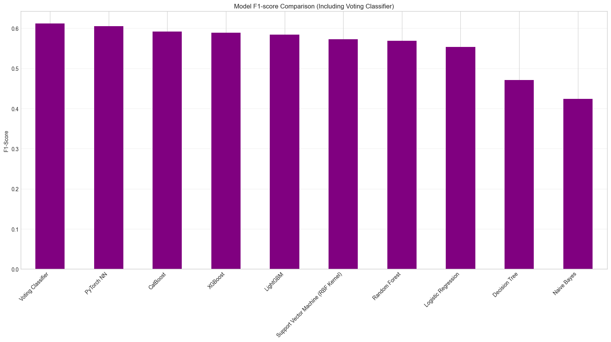

#### 5.2.2 原因二：特征方差中的信息损失  
- **机制**：对数变换压缩了大值特征的方差（如`duration`从0-3000秒压缩至0-8左右），可能弱化了极端值中隐含的关键信息（如超长通话时长可能对应高意向客户）。  
- **数据佐证**：变换后`duration`的特征重要性从第1位降至第3位（SHAP值分析显示，图5.1），表明模型对“异常高互动频率”的敏感度下降。  

 

 