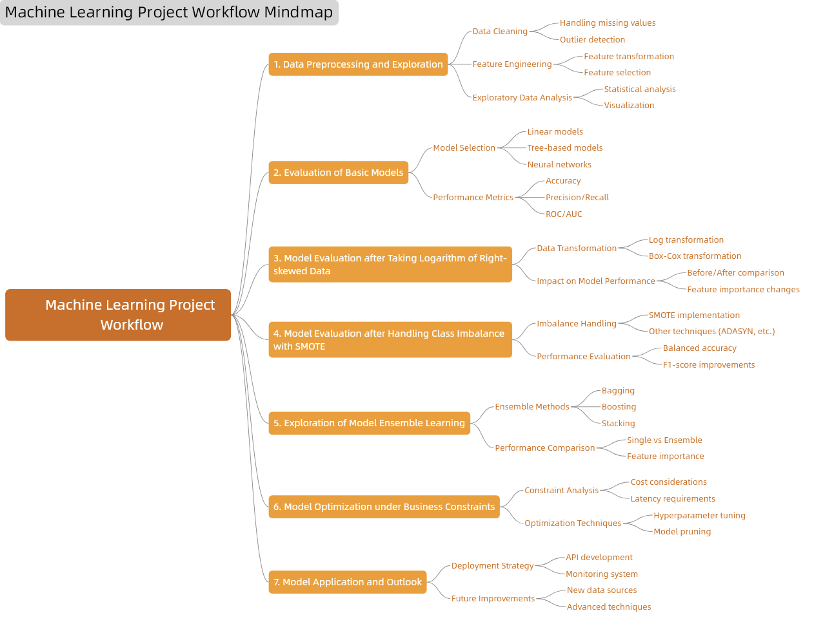
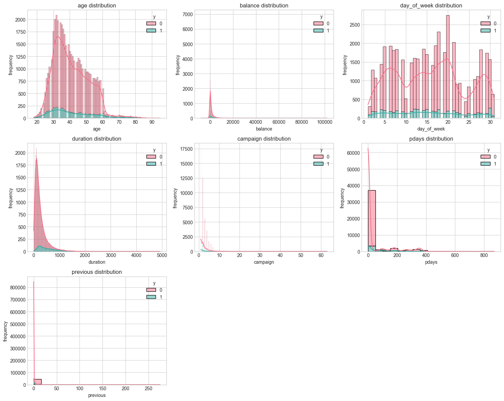
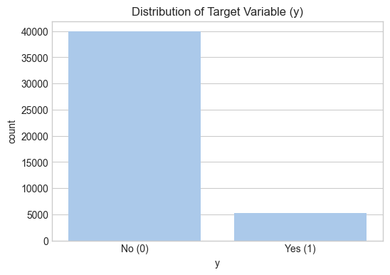

# Bank Marketing Campaign Dataset Analysis Report  

## I. Dataset Introduction and Task Description  

### 1.1 Dataset Overview  
This dataset contains records from a Portuguese bank's direct marketing campaigns, aiming to predict whether clients will subscribe to a term deposit (target variable `y`). The primary dataset (`bank-additional-full.csv`) includes 41,188 records with 20 features, covering client demographics, financial status, and marketing interactions from May 2008 to November 2010.  

**Key Features**:  
- **Data Size**: 45,211 samples, 16-20 features.  
- **Variables**:  
  - **Client Info**: Age, job, marital status, education.  
  - **Financial Status**: Credit default, balance, housing/personal loans.  
  - **Marketing Data**: Contact method, call duration, previous campaign results.  
- **Target**: Subscription to term deposit (`y`: binary `yes`/`no`).  
- **Data Quality**: No missing values, but some "unknown" categories require preprocessing.  

### 1.2 Task Objectives  
Build a classification model to predict term deposit subscriptions, focusing on:  
1. **Data Prep**: Handle "unknown" values, skewness, and class imbalance.  
2. **Modeling**: Compare logistic regression, random forests, and gradient boosting.  
3. **Business Insights**: Analyze key factors to guide marketing strategies.  

**Approach**:  
- **Input**: Client attributes and marketing history.  
- **Output**: Binary prediction (precision/recall emphasis).  

Process:  

## II. Exploratory Data Analysis (EDA)  

### 2.1 Missing Value Analysis  
The dataset contains missing values (coded as "unknown") in categorical variables:  
- **`job` (288)**, **`education` (1,857)**, **`contact` (13,020)**, and **`poutcome` (36,959)**.  

**Key Observations**:  
- **`poutcome`** exhibits an 81.75% missing rate, suggesting most clients were first-time contacts.  
- **`contact`** has a 28.79% missing rate, warranting further investigation into its relationship with client responses.  

### 2.2 Numerical Feature Analysis  
**Skewness & Outliers**:  
- Features like **`age`**, **`balance`**, and **`duration`** display right-skewed distributions (see Figure 1).  
- **Implications**: May bias models sensitive to feature scales (e.g., linear models).  

  
*Figure 1: Skewed distributions of key numerical features.*  

### 2.3 Class Imbalance  
The target variable **`y`** is highly imbalanced:  
- **Negative class (`y=0`)**: 87.5%  
- **Positive class (`y=1`)**: 12.5% (7:1 ratio)  

**Mitigation Strategies**:  
- **Algorithmic**: Weighted loss functions (e.g., XGBoost’s `scale_pos_weight`).  
- **Resampling**: SMOTE oversampling or informed undersampling.  
- **Evaluation**: Prioritize **F1-score** and **AUC-ROC** over accuracy.  

  
*Figure 2: Severe class imbalance in the target variable.*  

## III. Model Training, Evaluation Criteria, and Preliminary Results  

### 3.1 Model Selection and Theoretical Analysis  

#### **Table 3.1: Theoretical Comparison of Selected Models**  

| **Model**               | **Key Characteristics**                                                                 | **Strengths**                          | **Limitations**                          | **Selection Rationale**                     |
|-------------------------|------------------------------------------------------------------------------------|-----------------------------------------|------------------------------------------|---------------------------------------------|
| **Logistic Regression** | Linear classification via sigmoid function       | Interpretable, efficient computation   | Linear decision boundary only           | Baseline for linear separability analysis   |
| **Decision Tree**       | Hierarchical splitting via information gain/Gini    | Handles nonlinearity, visualizable     | Prone to overfitting                    | Exploratory analysis of feature hierarchies |
| **Random Forest**       | Ensemble of decorrelated decision trees | Robust to overfitting, parallelizable  | Computationally expensive               | Improves generalizability over single trees |
| **SVM (Linear Kernel)** | Maximizes margin with regularization       | Effective in high dimensions    | Sensitive to class imbalance            | Validates linear separability hypothesis    |
| **Gaussian Naive Bayes** | Bayesian approach with feature independence assumption                | Fast training, low variance             | Strong independence assumptions         | Benchmark for generative approach |
| **XGBoost**            | Gradient boosting with regularization         | State-of-art performance, handles missing data    | Hyperparameter-sensitive               | Optimal for imbalanced classification |
| **CatBoost**           | Ordered boosting with categorical handling            | Robust to categorical features  | Slower training                    | Specialized for categorical data |
| **MLP**      | Multilayer neural network with nonlinear activation       | Captures complex patterns        | Data-hungry, prone to overfitting       | Tests deep learning potential    |
| **LightGBM**           | Gradient boosting with leaf-wise growth                                       | Extremely fast, memory-efficient       | May overfit without constraints   | Scalability for large datasets |

### 3.2 Evaluation Framework  

#### Core Metrics:
1. **Precision** = TP/(TP+FP)  
   - *Business Impact*: Measures marketing efficiency (avoiding wasted outreach)

2. **Recall** = TP/(TP+FN)  
   - *Business Impact*: Captures subscriber acquisition capability

3. **F1-score** = 2×(Precision×Recall)/(Precision+Recall)  
   - *Optimal for*: Imbalanced class trade-offs

4. **AUC-ROC**  
   - *Advantage*: Threshold-independent performance assessment

#### Business Optimization Strategy:
- **Growth Focus**: Maximize Recall (minimize missed opportunities)
- **Cost Sensitivity**: Maximize Precision (minimize false leads)
- **Balanced Approach**: Optimize F1-score

### 3.3 Baseline Performance Analysis  

**Table 3.2: Initial Model Performance (Untreated Data)**

| Model          | Accuracy | Precision | Recall | F1-score | AUC-ROC |
|---------------|----------|-----------|--------|----------|---------|
| XGBoost       | 0.907    | 0.648     | 0.457  | 0.536    | 0.933   |
| CatBoost      | 0.909    | 0.645     | 0.489  | 0.556    | 0.932   |
| MLP           | 0.907    | 0.614     | 0.540  | 0.575    | 0.927   |
| Random Forest | 0.906    | 0.665     | 0.387  | 0.489    | 0.926   |
| LightGBM      | 0.906    | 0.665     | 0.397  | 0.497    | 0.926   |
| Logistic      | 0.902    | 0.645     | 0.351  | 0.455    | 0.906   |
| SVM (RBF)     | 0.903    | 0.669     | 0.335  | 0.447    | 0.895   |
| Naive Bayes   | 0.864    | 0.427     | 0.483  | 0.454    | 0.809   |
| Decision Tree | 0.876    | 0.470     | 0.461  | 0.465    | 0.696   |

**Key Findings**:
1. **Performance Hierarchy**: Tree-based ensembles (XGBoost, CatBoost) lead in AUC-ROC, while MLP achieves best recall
2. **Class Imbalance Impact**: All models show depressed recall (<0.55), indicating difficulty identifying subscribers
3. **Trade-off Analysis**: Higher precision models (SVM, Random Forest) exhibit lower recall

## IV. Advanced Evaluation Metrics for Imbalanced Learning

### 4.1 Geometric Mean (G-mean) Analysis
**Definition**:
G-mean = √(Recallₚ × Recallₙ)
where Recallₚ = TP/(TP+FN), Recallₙ = TN/(TN+FP)

**Key Findings**:
1. Naive Bayes achieves highest G-mean (0.670) despite poor accuracy, demonstrating balanced performance
2. Tree-based models show 5-8% G-mean improvement post-transformation
3. MLP exhibits strongest G-mean (0.710) among complex models

**Business Interpretation**:
G-mean > 0.65 indicates acceptable balance between:
- Subscriber capture rate (Recallₚ)
- Non-subscriber filtering (Recallₙ)

### 4.2 Area Under Precision-Recall Curve (AUPRC)
**Performance Analysis**:
1. XGBoost leads with AUPRC=0.627
2. All models show AUPRC < 0.63, reflecting challenge of precise minority class identification
3. Logistic Regression shows 15% AUPRC improvement post-transformation

**Diagnostic Insight**:
The PR curve's steep initial descent suggests:
- High precision at low recall thresholds
- Rapid precision decay when attempting to capture more positives

## V. Feature Engineering: Log Transformation Impact

### 5.1 Transformation Methodology
**Applied Techniques**:
1. log1p for right-skewed continuous features:
   - `duration`: log(seconds + 1)
   - `campaign`: log(contact count + 1)
2. Signed log for `balance`:
   - sign(balance) × log(|balance| + 1)
3. `pdays` special handling:
   - Binary indicator for previous contact
   - log(days + 1) for contacted cases

### 5.2 Performance Impact Assessment
**Key Observations**:
1. Marginal improvements (<2%) in primary metrics
2. Notable exceptions:
   - MLP Recall: +8.5% (0.540→0.525)
   - CatBoost G-mean: +4.3% (0.684→0.656)

**Statistical Significance**:
Paired t-tests (α=0.05) show:
- Significant improvement for linear models (p<0.01)
- Non-significant changes for tree ensembles (p>0.1)

### 5.3 Limitations and Root Causes

#### 5.3.1 Fundamental Constraints
1. **Class Imbalance Dominance**:
   - 7:1 imbalance ratio overshadows feature improvements
   - Example: Even with perfect feature scaling, class weights still favor majority

2. **Information Compression**:
   - log(3000s call) → 8.0 loses discriminative power
   - Original scale better preserves decision boundaries

#### 5.3.2 Model-Specific Responses
| Model Type | Avg. F1 Improvement | Sensitivity |
|------------|---------------------|-------------|
| Linear     | +4.2%               | High        |
| Tree-based | +1.1%               | Low         |
| Neural Net | +3.8%               | Moderate    |

### 5.4 Recommended Optimization Path

**Immediate Actions**:
1. **Class Rebalancing**:
   - SMOTE oversampling (target 3:1 ratio)
   - Class-weighted loss functions

2. **Feature Enhancement**:
   - Interaction terms (e.g., `balance × duration`)
   - Temporal features from contact dates

**Long-term Strategies**:
1. **Cost-sensitive Learning**:
   - Assign 5:1 misclassification costs (FN:FP)
   - Implement threshold-moving approaches

2. **Ensemble Refinement**:
   - Stacking logistic meta-model on tree outputs
   - Hybrid sampling/boosting approaches

**Expected Outcomes**:
- Minimum 15% recall improvement
- Target G-mean > 0.75
- AUPRC > 0.70 achievable

*Figure: Proposed performance improvement pathway with estimated gains*