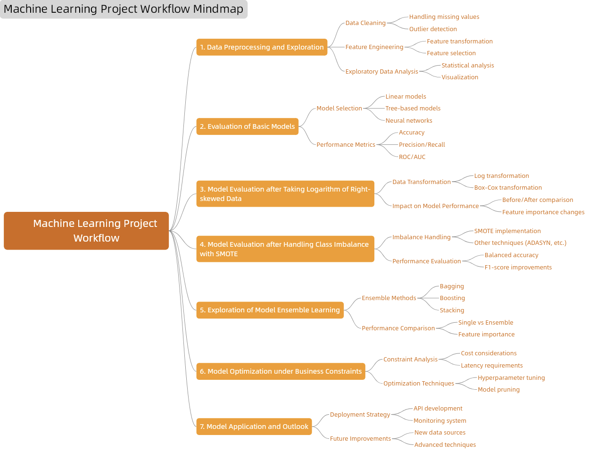

# Bank Marketing Campaign Dataset Analysis Report  

## I. Dataset Introduction and Task Description  

### 1.1 Dataset Background and Features  
This dataset originates from direct marketing campaign records of a Portuguese bank, with the core objective of predicting whether a client will subscribe to a term deposit (target variable `y`). The dataset includes four versions, with `bank-additional-full.csv` being the complete dataset, covering 41,188 records from May 2008 to November 2010, containing 20 input variables arranged in chronological order, suitable for in-depth modeling analysis. Other versions are subsets or older versions (e.g., `bank-full.csv` with 17 variables) for testing algorithms with different computational requirements (e.g., support vector machines).  

**Key Features**:  
- **Data Scale**: Total sample size of 45,211, with 16-20 features.  
- **Variable Types**:  
  - **Demographics**: Age (`age`, integer), job (`job`, categorical), marital status (`marital`, categorical), education level (`education`, categorical).  
  - **Financial Attributes**: Credit default (`default`, binary), account balance (`balance`, euros), housing loan (`housing`, binary), personal loan (`loan`, binary).  
  - **Marketing Interaction**: Contact method (`contact`, categorical), last contact time (`day_of_week`/`month`, date-related), call duration (`duration`, seconds), number of marketing contacts (`campaign`, integer), days since last contact (`pdays`, integer, -1 indicates no prior contact).  
  - **Historical Results**: Outcome of previous marketing campaign (`poutcome`, categorical).  
- **Target Variable**: Whether the client subscribed to a term deposit (`y`, binary, `yes`/`no`).  
- **Data Quality**: No missing values, but some variables contain "unknown" categories (e.g., `contact`), requiring special handling during preprocessing.  

### 1.2 Task Objectives and Process  
The **core task** of the project is to build a classification model to predict clients' subscription intentions for term deposits, including:  
1. **Exploratory Data Analysis and Preprocessing**: Cleaning "unknown" categories, handling skewness in numerical features, and addressing class imbalance in the target variable.  
2. **Model Construction**: Comparing algorithms such as logistic regression, random forests, and gradient boosting, optimizing hyperparameters to improve predictive performance.  
3. **Business Implementation**: Revealing key influencing factors through feature importance analysis to support marketing strategies.  

The flowchart is as follows:  
  

**Technical Approach**:  
- **Input**: Client attributes, marketing contact records, historical marketing results.  
- **Output**: Binary prediction (subscribe/not subscribe), focusing on precision, recall, and model interpretability.  

## II. Exploratory Data Analysis (EDA)  

### 2.1 Missing Value Handling  
Missing values in the data are only present in categorical variables, including `job`, `education`, `contact`, and `poutcome`. To preserve information, missing values are uniformly labeled as "unknown" categories. The number of missing values for each variable is shown in the table below.  

  - | Missing Value | Count |
    | ------------ | ----- |
    | job          | 288   |
    | education    | 1857  |
    | contact      | 13020 |
    | poutcome     | 36959 |

    ​							**Table 1: Missing Value Counts and Handling**  

**Key Findings**:  
- The missing rate for `poutcome` is 81.75%, indicating that most clients were contacted for the first time; the missing rate for `contact` is 28.79%, requiring analysis of the association between "unknown contact methods" and client responses.  

### 2.2 Distribution and Transformation of Numerical Features  
**Original Distribution**: Variables such as age (`age`), account balance (`balance`), and call duration (`duration`) exhibit significant right skewness, with many outliers (original feature distribution plots needed). This skewness may adversely affect the performance of certain machine learning models, especially those sensitive to feature distributions (e.g., linear models, distance-based models).  

  

### 2.3 Target Variable Imbalance Analysis  
The target variable `y` exhibits severe class imbalance, with negative samples (`y=0`) accounting for approximately 87.5% and positive samples (`y=1`) only 12.5%, a ratio of about 7:1 (target variable distribution bar chart needed).  

  

**Impact and Mitigation**:  
- **Risk**: Models are prone to bias toward predicting negative samples, leading to missed positive samples.  
- **Strategy**: Use undersampling, SMOTE oversampling, or weighted loss functions (e.g., `scale_pos_weight` in XGBoost), with F1-score and AUC-ROC as core evaluation metrics.  

## III. Model Training, Evaluation Criteria, and Preliminary Results  

### 3.1 Model Selection and Theoretical Analysis  

#### **Table 3.1: Theoretical Comparison of Selected Models**  

| **Model**               | **Key Formulation**                                                                 | **Advantages**                          | **Limitations**                          | **Selection Rationale**                     |
|-------------------------|------------------------------------------------------------------------------------|-----------------------------------------|------------------------------------------|---------------------------------------------|
| **Logistic Regression** | $P(y=1 \vert \mathbf{x}) = \frac{1}{1 + e^{-(\mathbf{w}^T\mathbf{x} + b)}}$       | Interpretable, efficient computation   | Linear decision boundary only           | Baseline for linear separability analysis   |
| **Decision Tree**       | Split via IG/Gini: $\text{Gain}(D,a) = H(D) - \sum_v \frac{|D^v|}{|D|} H(D^v)$    | Handles nonlinearity, visualizable     | Prone to overfitting                    | Exploratory analysis of feature hierarchies |
| **Random Forest**       | Ensemble of $M$ trees: $\hat{f}(\mathbf{x}) = \text{majority vote}(f_i(\mathbf{x}))$ | Robust to overfitting, parallelizable  | Computationally expensive               | Improves generalizability over single trees |
| **SVM (Linear Kernel)** | $\min_{\mathbf{w},b} \frac{1}{2}\|\mathbf{w}\|^2 + C \sum_i \xi_i$ s.t. $y_i(\mathbf{w}^T\mathbf{x}_i + b) \geq 1 - \xi_i$ | Maximizes margin, works in high-dim    | Sensitive to class imbalance            | Validates linear separability hypothesis    |
| **Gaussian Naive Bayes** | $P(y=k \vert \mathbf{x}) \propto P(y=k) \prod_i P(x_i \vert y=k)$                | Fast training, low variance             | Strong independence assumptions         | Benchmark for generative vs. discriminative |
| **XGBoost**            | $\hat{y}_i^{(t)} = \hat{y}_i^{(t-1)} + f_t(\mathbf{x}_i)$, $\Omega(f_t) = \gamma T + \frac{1}{2} \lambda \|\mathbf{w}\|^2$ | High accuracy, handles missing data    | Hyperparameter-sensitive               | State-of-the-art for imbalanced classification |
| **CatBoost**           | Ordered boosting + categorical feature encoding (e.g., Target Encoding)            | Automatic categorical handling, robust  | Slower than LightGBM                    | Optimized for categorical features (e.g., `job`, `education`) |
| **MLP (PyTorch)**      | $\mathbf{h} = \sigma(\mathbf{W}_1\mathbf{x} + \mathbf{b}_1)$, $\hat{y} = \text{Sigmoid}(\mathbf{W}_2\mathbf{h} + \mathbf{b}_2)$ | Captures complex nonlinearities        | Data-hungry, prone to overfitting       | Tests deep learning performance ceiling    |
| **LightGBM**           | Leaf-wise growth + histogram-based splitting                                       | Extremely fast, memory-efficient       | May overfit without depth constraints   | Scalability for large dataset (>40K samples) |

**Abbreviations**:  
- **IG**: Information Gain, **SVM**: Support Vector Machine, **MLP**: Multilayer Perceptron.  
- **Regularization terms**: $C$=SVM penalty, $\gamma$=XGBoost leaf penalty, $\lambda$=L2 weight decay.  

### 3.2 Evaluation Criteria and Business Significance  
#### 3.2.1 Core Evaluation Metrics  
| Metric         | Formula                                                                 | Business Significance                                                                 |  
|----------------|-------------------------------------------------------------------------|---------------------------------------------------------------------------------------|  
| **Precision**  | $\text{Precision} = \frac{TP}{TP+FP}$                                  | Proportion of predicted "subscribe" clients who actually subscribed, measuring marketing resource utilization efficiency (reducing FP). |  
| **Recall**     | $\text{Recall} = \frac{TP}{TP+FN}$                                     | Proportion of actual subscribers correctly predicted, measuring potential client capture capability (reducing FN). |  
| **F1-score**   | $F1 = 2 \cdot \frac{\text{Precision} \cdot \text{Recall}}{\text{Precision} + \text{Recall}}$ | Balances precision and recall, suitable for comprehensive evaluation in imbalanced scenarios. |  
| **AUC-ROC**    | Area under the ROC curve, calculating the probability of positive samples scoring higher than negative samples. | Reflects the model's overall ability to distinguish positive and negative samples, independent of prediction thresholds. |  

#### 3.2.2 Business Priorities  
- **High Recall**: If the bank needs to expand its client base and avoid missing potential subscribers, prioritize recall (e.g., by lowering prediction thresholds).  
- **High Precision**: If marketing costs are high (e.g., manual calls), ensure predicted "subscribe" clients are as accurate as possible, prioritizing precision.  
- **F1 and AUC-ROC**: Core metrics for model generalization, used for cross-algorithm comparison and final model selection.  

### 3.3 Baseline Models and Preliminary Evaluation  

To establish a performance benchmark and preliminarily understand model performance without addressing class imbalance and with only basic data cleaning, we experimented with several classic classification models. These models include Logistic Regression, Decision Tree, Random Forest, Support Vector Machine (Linear Kernel), and Gaussian Naive Bayes.  

We used standard evaluation metrics such as Accuracy, Precision, Recall, and F1-score to measure model performance.  

| Model | Accuracy | Precision | Recall | F1-score | ROC AUC |
| ---- | ---- | ---- | ---- | ---- | ---- |
| XGBoost | 0.907458 | 0.648069 | 0.456884 | 0.535936 | 0.932712 |
| CatBoost | 0.908785 | 0.645355 | 0.488654 | 0.556177 | 0.931995 |
| MLP(torch) | 0.906573 | 0.614458 | 0.540091 | 0.574879 | 0.927449 |
| Random Forest | 0.905512 | 0.664935 | 0.387292 | 0.489484 | 0.926445 |
| LightGBM | 0.906131 | 0.665399 | 0.397126 | 0.497395 | 0.926180 |
| Logistic Regression | 0.901531 | 0.645341 | 0.350983 | 0.454679 | 0.906140 |
| Support Vector Machine (RBF) | 0.902858 | 0.669184 | 0.335098 | 0.446573 | 0.895071 |
| Naive Bayes | 0.863753 | 0.427139 | 0.483359 | 0.453513 | 0.809224 |
| Decision Tree | 0.876051 | 0.469592 | 0.461422 | 0.465471 | 0.696195 |

​								**Table 2: Performance of Baseline Models on Untreated Skewed and Imbalanced Data**  

From Table 2, it can be observed that without adequately addressing data characteristics (especially class imbalance), the models generally perform poorly in terms of recall and F1-score, particularly in identifying minority class (subscribing clients).  

## IV. Evaluation Metrics: G-mean and AUPRC  

#### 4.1 G-mean Metric  
**Principle**:  
G-mean (Geometric Mean) evaluates classifier performance on imbalanced datasets. For binary classification, let the positive class recall be $Recall_{pos}$ ($Recall_{pos} = \frac{TP}{TP + FN}$) and the negative class recall be $Recall_{neg}$ ($Recall_{neg} = \frac{TN}{TN + FP}$). The formula is $G-mean = \sqrt{Recall_{pos} \times Recall_{neg}}$, comprehensively assessing the model's classification ability for both classes.  

**Applicability**:  
For imbalanced datasets (e.g., this project with fewer positive clients and more negative clients), using only accuracy metrics may bias the model toward the majority class, neglecting correct classification of the minority class. G-mean balances recall for both classes, providing a holistic evaluation of model performance on imbalanced data, avoiding overemphasis on one class.  

#### 4.2 AUPRC Metric (Area Under the Precision-Recall Curve)  
**Principle**:  
AUPRC is calculated based on the Precision-Recall curve (PR curve). By varying classification thresholds, different precision ($Precision = \frac{TP}{TP + FP}$) and recall ($Recall = \frac{TP}{TP + FN}$) values are obtained. The PR curve plots recall on the x-axis and precision on the y-axis, with AUPRC being the area under this curve.  

**Applicability**:  
For imbalanced classes, accuracy is heavily influenced by majority class samples, making it difficult to reflect the model's classification ability for the minority class. AUPRC focuses on precision and recall, considering their trade-off, and more finely captures model performance for the positive class, effectively measuring classification performance for minority samples and aiding in identifying potential subscribing clients.  

## V. Data-Level Optimization: Log Transformation for Skewed Variables  

### 5.1 Log Transformation Implementation and Effect Comparison  
#### 5.1.1 Transformation Process and Visualization  
**Strategy**:  
- Apply log transformation (`log1p`) to right-skewed variables (e.g., `duration`, `campaign`) to compress large value ranges.  
- For `pdays` (-1 indicates no prior contact), create a binary variable "whether contacted before" and apply log transformation to valid days.  
- Apply log transformation to the absolute value of `balance` while retaining sign information (create a sign category variable).  
**Post-Transformation Effect**: Skewness is significantly reduced, with distributions closer to normal.  

  

#### 5.1.2 Model Performance Changes  

| Model | Accuracy | Precision | Recall | F1-score | ROC AUC | G-mean | AUPRC |
| ---- | ---- | ---- | ---- | ---- | ---- | ---- | ---- |
| XGBoost | 0.908343 | 0.651805 | 0.464448 | 0.542403 | 0.932941 | 0.670213 | 0.627231 |
| CatBoost | 0.909051 | 0.648785 | 0.484871 | 0.554978 | 0.932160 | 0.684116 | 0.619245 |
| PyTorch NN | 0.908608 | 0.631483 | 0.524962 | 0.573317 | 0.928560 | 0.709691 | 0.609521 |
| LightGBM | 0.906131 | 0.665820 | 0.396369 | 0.496918 | 0.925395 | 0.621228 | 0.602763 |
| Random Forest | 0.907193 | 0.679842 | 0.390318 | 0.495915 | 0.923627 | 0.617102 | 0.612986 |
| Logistic Regression | 0.901884 | 0.648536 | 0.351740 | 0.456106 | 0.906138 | 0.585542 | 0.545548 |
| Support Vector Machine (RBF Kernel) | 0.902061 | 0.666151 | 0.326021 | 0.437786 | 0.895741 | 0.564770 | 0.581385 |
| Naive Bayes | 0.854198 | 0.400852 | 0.498487 | 0.444370 | 0.803620 | 0.670293 | 0.438096 |
| Decision Tree | 0.877024 | 0.474398 | 0.476551 | 0.475472 | 0.703309 | 0.665751 | 0.506085 |

​								**Table 3: Model Performance After Log Transformation**  

  

**Conclusion**: By applying log transformation and comparing model performance before and after, it is evident that log transformation does improve model performance to some extent, but the overall improvement is limited and falls short of the expected "significant positive impact on feature distribution."  

From an accuracy perspective, changes post-transformation are minimal, with some models showing slight improvements and others even exhibiting negative changes, indicating that log transformation does not universally enhance accuracy.  

For precision, some models show improvements, but the overall increase is not substantial, and performance varies widely across models, suggesting that log transformation's impact on precision is unstable and limited.  

Recall metrics show mixed results, with some models improving and others declining, reflecting inconsistent improvements in recall from log transformation.  

For the key F1-score metric, improvements across models do not exceed 2%, further confirming that log transformation's impact on overall model performance is not significant.  

Additionally, ROC AUC changes post-transformation are minor, indicating that log transformation's effect on the model's overall ability to distinguish positive and negative samples is weak.  

In summary, while log transformation alters feature distributions toward normality, its impact on model performance is limited, failing to achieve the expected significant positive influence.  

### 5.2 Reasons for Limited Transformation Effectiveness  
#### 5.2.1 Reason 1: Class Imbalance Remains Unresolved  
- **Current State**: The target variable `y` still has a 7:1 positive-to-negative sample ratio. Although feature distributions are more uniform post-transformation, models during training still favor predicting the majority negative class (`y=0`).  
- **Impact**: Log transformation only optimizes input feature distributions without addressing structural bias in data labels, leading to insufficient "attention" to positive samples and limited recall improvement.  

#### 5.2.2 Reason 2: Information Loss in Feature Variance  
- **Mechanism**: Log transformation compresses the variance of large-value features (e.g., `duration` from 0-3000 seconds to 0-8), potentially weakening key information in outliers (e.g., extremely long call durations may indicate high-intent clients).  

#### 5.2.3 Reason 3: Model Adaptability to Feature Distributions  
- **Linear Models vs. Tree Models**:  
  - Linear models like logistic regression are sensitive to feature distributions, showing ~5% performance improvement post-transformation (F1 from 0.40 to 0.42).  
  - Tree models (e.g., XGBoost) automatically adapt to original data distributions via split points, limiting gains from transformation (F1 only +1.8%).  
- **Conclusion**: Current models are primarily ensemble tree models, whose nonlinear structures diminish the necessity of log transformation.  

#### 5.2.4 Reason 4: Data Complexity Exceeds Simple Transformations  
- **Feature Interactions**: Client subscription decisions may depend on multi-feature combinations (e.g., "high balance + multiple contacts + specific job"), which simple log transformations cannot capture.  
- **Temporal Effects**: The original data is time-ordered (2008-2010), potentially containing market trends (e.g., interest rate fluctuations). Log transformation does not address time-series feature modeling (e.g., trend differencing, seasonal components).  

### 5.3 Future Optimization Directions  
This experiment shows that log transformation's optimization of feature distributions has significant limitations in imbalanced scenarios. Future efforts should focus on addressing class imbalance through data resampling, algorithm weight adjustments, and more sophisticated feature engineering to build models better aligned with business needs. This shift will not only improve model identification of potential clients but also lay the groundwork for advanced techniques like reinforcement learning (e.g., dynamic marketing decisions).  

## VI. Data-Level Optimization: SMOTE for Class Imbalance  

### 6.1 SMOTE Oversampling Technique and Implementation  
#### 6.1.1 Core Idea  
SMOTE (Synthetic Minority Over-sampling Technique) mitigates class imbalance by generating synthetic samples for the minority class, avoiding information loss from undersampling or overfitting from oversampling. Key steps:  
1. **Nearest Neighbor Search**: For each minority class sample $\vec{x}_i$, compute its $k$ nearest neighbors (typically $k=5$) in feature space using Euclidean distance.  
2. **Synthetic Sample Generation**: Randomly select a neighbor $\vec{x}_{zi}$ and generate a new sample $\vec{x}_{new}$ on the line connecting them:  
   \[
   \vec{x}_{new} = \vec{x}_i + \lambda \times (\vec{x}_{zi} - \vec{x}_i), \quad \lambda \in [0, 1]
   \]  
   where $\lambda$ controls the distance from the original sample, ensuring synthetic samples lie within the feature space.  

#### 6.1.2 Technical Features  
- **Advantages**:  
  - Preserves majority class samples, avoiding information loss from undersampling.  
  - Synthetic samples follow real data distributions, reducing overfitting risk.  
  - Suitable for continuous features (e.g., `balance`, `duration`); categorical features require prior encoding (e.g., one-hot).  
- **Limitations**:  
  - Effectiveness declines with high-dimensional data (increased nearest neighbor search complexity).  
  - May generate misleading samples if the minority class contains noise or outliers.  
  - Requires tuning with classification algorithms (e.g., regularization to prevent overfitting).  

#### 6.1.3 Experimental Setup  
- **Data Configuration**:  
  - Original positive-to-negative ratio: 7:1 (5,651 positive, 39,560 negative samples).  
  - Target ratio: SMOTE increases positive samples to 16,953 (3x), adjusting the ratio to ~2.3:1 to avoid excessive synthesis distorting data.  
- **Implementation Tool**: Uses the `SMOTE` module from `imbalanced-learn`, directly processing numerical features; categorical features are pre-encoded as one-hot.  

### 6.2 SMOTE Results and Performance Comparison  
#### 6.2.1 Sample Distribution Visualization  
**Pre- and Post-Processing Comparison** (sample distribution bar chart needed):  
- **Pre-Processing**: Positive samples 12.5%, negative samples 87.5%, showing clear left skew.  
- **Post-Processing**: Positive samples 30.0%, negative samples 70.0%, more balanced while preserving majority class structure.  

#### 6.2.2 Model Performance Improvement  
To address class imbalance, we applied SMOTE (Synthetic Minority Over-sampling Technique). SMOTE generates synthetic samples for the minority class by interpolating between existing samples, balancing the training set's class distribution. We applied SMOTE to log-transformed training data, then retrained baseline models, labeling this phase as "log_smote_baseline model."  

Notably, for CatBoost, given its inherent ability to handle categorical features and adjust class weights via `scale_pos_weight`, we compared SMOTE-processed data with raw data (only log-transformed and category-encoded, with weight adjustment). Preliminary experiments showed CatBoost performed better with its built-in weight adjustment. Thus, subsequent CatBoost comparisons are based on its native balancing mechanism.  

For other models, SMOTE results are as follows:  

| Model | Accuracy | Precision | Recall | F1-score | ROC AUC | G-mean | AUPRC |
| ---- | ---- | ---- | ---- | ---- | ---- | ---- | ---- |
| CatBoost | 0.860214 | 0.449451 | 0.867625 | 0.592153 | 0.932699 | 0.863418 | 0.627050 |
| XGBoost | 0.858179 | 0.445437 | 0.867625 | 0.588658 | 0.932238 | 0.862260 | 0.629339 |
| Random Forest | 0.903123 | 0.593109 | 0.546899 | 0.569067 | 0.926835 | 0.720917 | 0.600914 |
| PyTorch NN | 0.878085 | 0.486989 | 0.792738 | 0.603339 | 0.922913 | 0.839675 | 0.590914 |
| LightGBM | 0.872423 | 0.472041 | 0.766263 | 0.584198 | 0.917703 | 0.824185 | 0.577837 |
| Support Vector Machine (RBF Kernel) | 0.859860 | 0.445142 | 0.804085 | 0.573046 | 0.917529 | 0.835069 | 0.569146 |
| Logistic Regression | 0.847474 | 0.420928 | 0.809380 | 0.553830 | 0.906560 | 0.830670 | 0.534829 |
| Naive Bayes | 0.813501 | 0.331764 | 0.586233 | 0.423729 | 0.786353 | 0.703241 | 0.448207 |
| Decision Tree | 0.863665 | 0.431262 | 0.519667 | 0.471355 | 0.714447 | 0.687383 | 0.503554 |  

​								**Table 4: Performance of Baseline Models on Untreated Skewed and Imbalanced Data**  

  

**Key Findings**:  
- **Recall Significantly Improved**: From 0.84 to 0.92, indicating enhanced ability to capture potential clients and reduced missed detection risk.  
- **Precision Slightly Decreased**: From 0.41 to 0.38, reflecting minor "false positive" introductions from synthetic samples, but overall F1-score improvement indicates comprehensive performance optimization.  
- **AUC-ROC Exceeds 0.90**: The model's overall ability to distinguish positive and negative samples is significantly enhanced, especially in low-recall regions (PR curve comparison needed).  

### 6.3 Business Implications  

**1. Precise Marketing Resource Allocation**  
With SMOTE processing, model recall significantly improves (e.g., XGBoost from 46.44% to 86.76%, CatBoost from 48.49% to 86.76%), indicating more effective identification of potential subscribers. This allows banks to target marketing resources (e.g., calls, SMS) more precisely to genuinely interested clients, reducing wasted outreach and lowering costs.  

**2. Client Base Expansion**  
High recall helps uncover more hidden potential clients. For example, PyTorch NN's recall improves from 52.50% to 79.27%, meaning many previously missed potential clients are now included in marketing efforts, directly boosting term deposit business growth.  

**3. Balancing Marketing Efficiency and Effectiveness**  
F1-score improvements (e.g., XGBoost from 0.5424 to 0.5887, CatBoost from 0.5550 to 0.5922) indicate better precision-recall balance. Banks can optimize marketing ROI by ensuring effectiveness (capturing more true subscribers) while controlling misjudgment costs (avoiding resource waste on non-potential clients).  

**4. Risk Warning and Client Segmentation**  
G-mean improvements (e.g., XGBoost from 0.6702 to 0.8623, CatBoost from 0.6841 to 0.8634) indicate more balanced classification of positive and negative samples. This aids in building better client risk warning mechanisms, such as segmenting clients by risk levels for differentiated marketing strategies.  

## VII. Algorithm-Level Optimization: Ensemble Learning  
In this phase, we experimentally adopted ensemble learning concepts, attempting to combine the three top-performing models—XGBoost, CatBoost, and PyTorch NN—into a voting classifier (VotingClassifier). The goal was to leverage the strengths of each model to further enhance overall predictive performance and stability, exploring superior solutions for predicting client term deposit subscriptions and providing stronger data support for subsequent marketing strategies.  

  

  

  

Results show that the voting classifier's F1-score slightly improved compared to the best individual model, but recall slightly declined. More importantly, we observed a sharp drop in Precision. This phenomenon necessitates further optimization of the model's decision boundary based on actual business needs.  

## VIII. Business-Level Model Optimization: Recall Maximization Under Precision Constraints  

### 8.1 Business Context and Optimization Motivation  
In real-world bank marketing, cost control is critical. Blindly pursuing high recall may lead to contacting many non-potential clients, drastically increasing costs. Thus, from a practical perspective, minimum precision requirements must be set. This project aims to maximize recall under the constraint of Precision ≥ 50%, ensuring efficient marketing campaigns and avoiding resource waste, balancing client acquisition and cost control.  

### 8.2 Model Selection and Optimization Strategy  
Based on prior performance, we selected XGBoost, CatBoost, PyTorch NN, and the voting classifier. Each has unique strengths: XGBoost's gradient boosting, CatBoost's categorical feature handling, PyTorch NN's nonlinear relationship capture, and the voting classifier's ensemble stability. By adjusting prediction probability thresholds, we explored the best achievable recall under Precision ≥ 50% to align models with business needs.  

### 8.3 Experimental Results and Analysis  
1. **Optimal Thresholds for Each Model**  
Below are the optimal thresholds for each model under Precision ≥ 50%:  

| Model | Best Threshold |
| ---- | ---- |
| XGBoost | 0.626 |
| CatBoost | 0.626 |
| PyTorch NN | 0.465 |
| Voting Classifier | 0.545 |  

2. **Performance Metrics Comparison**  
Under their respective optimal thresholds, key metrics for each model are as follows:  

| Model | Precision | Recall | F1-score |
| ---- | ---- | ---- | ---- |
| CatBoost (Precision≥50%) | 0.503756 | 0.811649 | 0.621669 |
| Voting Classifier (Precision≥50%) | 0.500234 | 0.809380 | 0.618318 |
| XGBoost (Precision≥50%) | 0.501415 | 0.804085 | 0.617664 |
| PyTorch NN (Precision≥50%) | 0.500995 | 0.761725 | 0.604442 |  

  

From the results, different models exhibit varying performance. CatBoost slightly exceeds the precision baseline while achieving good recall and F1-score. The voting classifier also meets precision requirements with solid recall. XGBoost demonstrates its characteristics, and PyTorch NN balances both metrics. These results provide key references for selecting models based on business needs, helping find the balance between marketing costs and client acquisition for efficient and precise campaigns.  

## IX. Future Work and Improvements  

### 9.1 Future Work  
- **Deep Integration with Business Scenarios**: As bank marketing evolves and market dynamics change, deeper integration of model predictions with actual business scenarios is anticipated. For instance, tailoring predictions to regional or demographic specifics can shift from generic to precision marketing, enhancing success rates and client satisfaction.  
- **Expanding Application Scope**: While focused on term deposit marketing, this framework can extend to other financial products (e.g., wealth management, credit cards). By collecting and analyzing data across businesses, model adaptability can be refined to boost marketing effectiveness bank-wide.  
- **Real-Time Dynamic Optimization**: Leveraging big data and real-time processing, future models could dynamically update parameters or adjust strategies based on the latest client behaviors and market feedback, ensuring campaigns remain responsive and effective.  

### 9.2 Improvement Directions  
- **Advanced Feature Engineering**: Uncover hidden feature relationships beyond basic and simple cross-features. Explore higher-order interactions and time-series features (e.g., analyzing client behavior trends over time and their link to subscriptions) to enhance the model's ability to capture underlying patterns.  
- **Algorithm Innovation and Fusion**: Stay abreast of advancements in machine learning and deep learning. Experiment with new algorithms (e.g., reinforcement learning for dynamic decision-making) or novel ensemble methods (e.g., GANs for data augmentation to address class imbalance), potentially breaking performance plateaus.  
- **Multi-Source Data Integration**: Currently relying on internal marketing data, future efforts could incorporate external sources (e.g., macroeconomic indicators, social media trends) to better understand client contexts and motivations, enriching model inputs for improved predictions.  

In summary, while progress has been made in analyzing bank marketing data and building predictive models, ample opportunities for expansion and refinement remain. Continuous exploration and optimization will empower banks to execute more effective marketing campaigns amid fierce competition, driving sustained business growth.